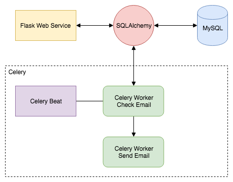

# Email Scheduler
This program is for send scheduled email to particular recipients of group. The program consist of 2 section. First, **API Endpoint** to add email data and recipient data to database. Second is **Task Scheduler** to check email data in database and send the email according to given timestamp.




## API Endpoint
API Endpoint is using **Flask** microframework to handle HTTP request and then parse the data from client to database wich is handled by **SQLAlchemy ORM**.

  

## Task Scheduler
The Task Scheduler is using **Celery Beat** to check database every minute and send any email data that scheduled to be send on given time. 
  

# API Endpoint

  

## Add Recipients

Endpoint to add recipient

**URL** : `/api/add_recipient`

**Method** : `POST`

**Data** : 

`event_id` :  `Integer`

`email_address` :  `String`

  **Format** :
  `x-www-form-urlencoded`

**Example** :

`event_id` :  `1`

`email_address` :  `email@email.com`

## Success Response

**Code** : `200 OK`

**Content**

```json
{
    "message": "successful",
    "status_code": 200
}
```

## Add Email

Endpoint to add scheduled email

**URL** : `/api/add_email`

**Method** : `POST`

  **Data** : 
  
`event_id` :  `Integer`

`email_subject` : `String`

`email_content` : `String`

`timestamp` : `String`

  **Format** :
  `x-www-form-urlencoded`

**Example** :

`event_id` :  `2`

`email_subject` : `Meeting`

`email_content` : `Meeting with client`

`timestamp` : `09-07-2018 18:21`

## Success Response

**Code** : `200 OK`

**Content**

```json
{
    "message": "successful",
    "status_code": 200
}
```

## Setup Application

Setup this program with virtualenv ( *assume RabbitMQ and MySQL is up and running* )

```

virtualenv -p python2.7 venv

```

Activate environment

```

source venv/bin/activate

```

Install dependencies

```

pip install -r requirements.txt

```


## Running API Endpoint

Setup Environment Variables for development

```

export FLASK_ENV=development

export FLASK_APP=run.py

```

Initialize Database

```

flask db init

flask db migrate

flask db upgrade

```


Run flask server

```

flask run

```

  ## Running Task Scheduler

  

First run celery beat

```

celery beat -A scheduler.worker --schedule=/tmp/celerybeat-schedule --loglevel=INFO --pidfile=/tmp/celerybe.pid

```

Then run celery worker

```

celery worker -A scheduler.worker --loglevel=INFO

```


## Requirements

- Python 2.7.14

- MySQL 5.7.21

- RabbitMQ 3.7.5
